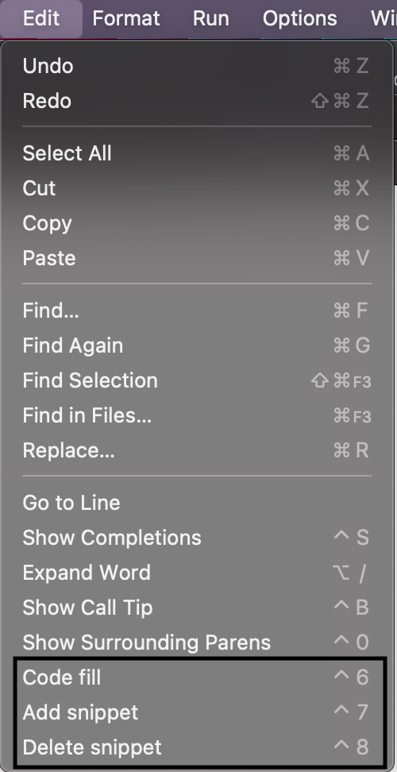
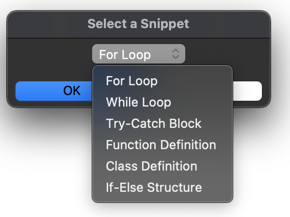
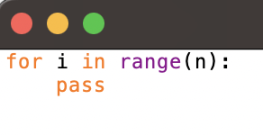
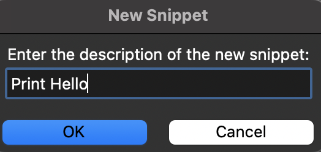
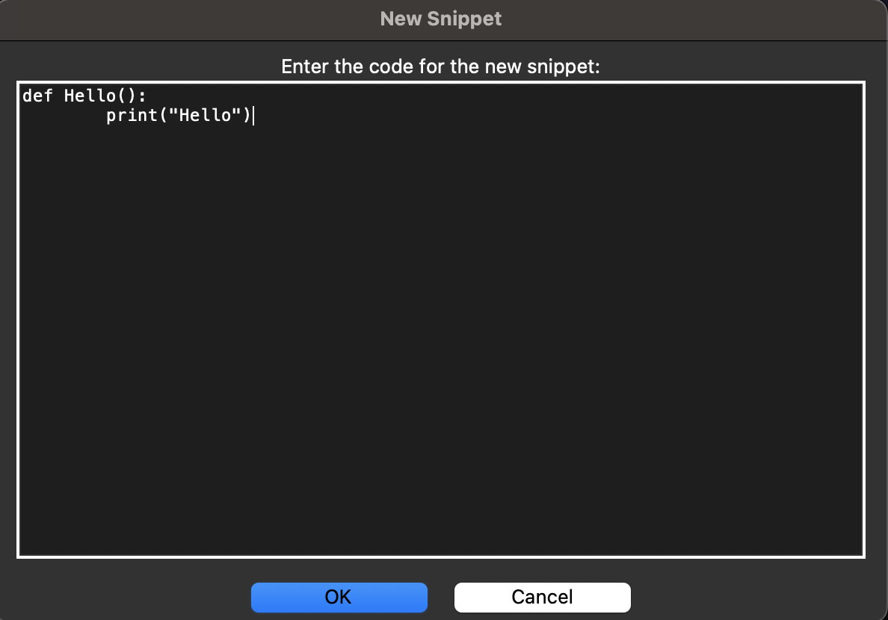
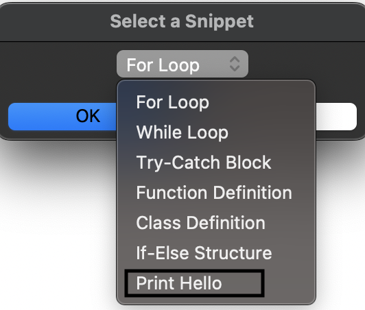
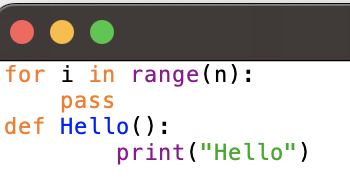
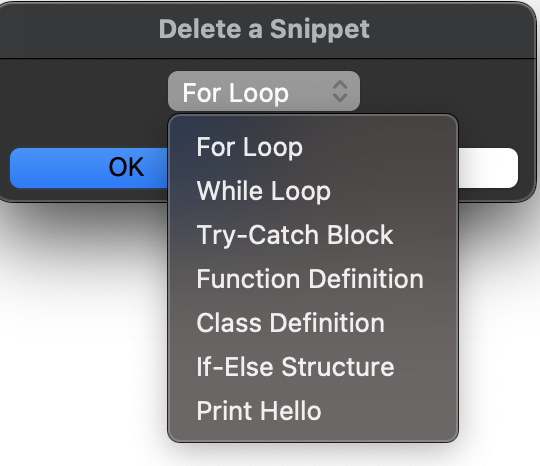
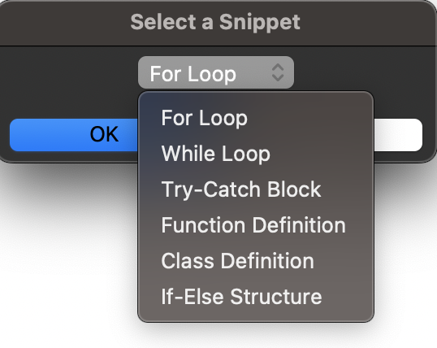
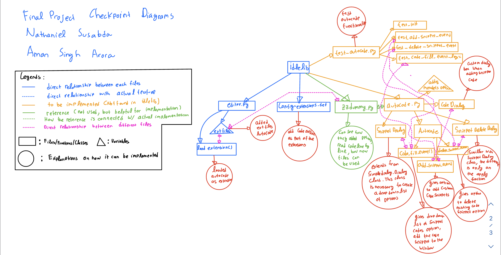

# Design Document

Nathaniel Susabda A17196946

Aman Singh Arora A15977180

Final Project Checkpoint - Code Fill (AutoCode) Extension

## Description of the project

One really helpful tool that a lot of IDEs such as VSCode or Pycharm have is the ability to autofill code snippets. Code snippets are basically pre-defined pieces of code which are usually very commmonly used, and can help the programmer/user save a lot of time by not having to write down these trivial pieces of code. This feature is also very helpful for new and novice programmers as it helps them avoid minor errors in syntaxing which might break their code.

We can implement this autofill feature as an extension to the IDLE ide. The option to autofill code can be enabled by the user when they are inside a editor window. The user will navigate to the options menu bar, which will then show an option to autofill snippets. Once the user clicks on this, it will open a dialogue box with different commonly use code snippets. The user can select one of the choices, after which the snippet will be pasted into the editor window where the user's cursor is present. The feature will also accomodate for syntaxing, for example if the user selects "for loop" from the code snippet options, then it will paste the format for a for loop in the editor window, and then place the user's cursor at the correct spot with indentation.

With each code snippet, the feature will also include comments which mention where the user should make their desired changes or add their code.

Also, we added the option for the user to add a custom code snippets. Thus, after the user has entered the custom snippets, it will be shown as an additional option from the drop down list. The user will also have the option to delete the snippets from the dropdown list. 

## Features Showdown

- 3 added options on the edit toolbar



**Code Fill Option**
- When Code Fill is clicked, it will shows a dropdown list of default options



- After we clicked OK on one of the options (in this case the For Loop)



**Add Snippet Option**
- When Add snippet is clicked, it will ask the user what the snippet description be



- After the user clicked OK, it will ask the user to write the code snippet



- After the user clicked OK, the next time they select Code Fill option, "Print Hello" option will be shown in the drop down list



- When the user select print hello and clicked OK, the custom snippet will be shown in the window



**Delete Snippet Option**

- When the user selects the delete snippet option, it will shows the drop down list of description of the available snippets


- When the user selects the "Print Hello" snippet and click OK, the next time they select Code Fill option, "Print Hello" snippet will no longer exist in the drop down list


## Discussion of implementation

**Diagrams**


**Necessary existing files and Explanation to implement the new feature:**

1. config-extensions.def
   
Add the autocode feature as an extension in this file (simillar with zzdummy that is shown on this file)

Added the following code for the autocode extension definition

```
[AutoCode]
enable= True
enable_shell = True
enable_editor = True
z-text= Z
[AutoCode_cfgBindings]
code-fill= <Control-6>
[AutoCode_bindings]
add-snippet= <Control-7>
[AutoCode_bindings]
delete-snippet= <Control-8>
```

2. editor.py

In this file, we can connect the new autocode extension with the main part of the code. Thus, we just added the new extension definition for autocode. Now, the main part of the code recognizes that there is a new extension

Added autocode as a new extfiles

```
extfiles = {  # Map built-in config-extension section names to file names.
        'ZzDummy': 'zzdummy',
        'AutoCode': 'autocode',
        }
```


**New Files implemented:**

1. autocode.py

This will be the file that contains the implementation of autocode feature. 

2. test_autocode.py

This will be the file that is used for unit testing the autocode feature

**Necessary Classes, Functions, and Variables in autocode.py:**

1. SnippetDialog class

This class extends the simpledialog.Dialog class from the tkinter module. It defines a UI for a dialog box to select from the available code snippets. This class is necesary because the drop down list cannot be implemented without extending the implementation of simpledialog.Dialog class.

- __init__(self, parent, title, snippets): This is the initializer method for the class. It takes in parent, title, and snippets as arguments. The snippets argument is expected to be a dictionary of code snippets. This method calls the parent class's __init__ method to create the dialog box.

- body(self, master): This method creates the body of the dialog box. It sets the title of the dialog box, initializes a StringVar to hold the selected option, and creates a dropdown menu (OptionMenu) with the snippet names as options.

- apply(self): This method is called when the user confirms their selection (i.e., clicks the OK button). It sets the result attribute of the instance to the code of the selected snippet.

2. SnippetDeleteDialog class

This class also extends the simpledialog.Dialog class and defines a UI for a dialog box to select a snippet to delete.This class is necessary for the drop down list for the delete snippet option. The functions in this class are similar with the SnippetDialog class. The only difference is the apply function.

- __init__(self, parent, title, snippets): This is the initializer method for the class. It takes parent, title, and snippets as arguments. The snippets argument is expected to be a dictionary of code snippets. This method calls the parent class's __init__ method to create the dialog box.

- body(self, master): This method creates the body of the dialog box. It sets the title of the dialog box, initializes a StringVar to hold the selected option, and creates a dropdown menu (OptionMenu) with the names of the snippets as options.

- apply(self): This method is called when the user confirms their selection (i.e., clicks the OK button). It sets the result attribute of the instance to the name of the selected snippet. This is the snippet that the user wants to delete.

3. CodeDialog class

This class is a UI for a dialog box where users can type in the code for a new snippet they want to add. It extends the simpledialog.Dialog class and customizes it with a Text widget. This class is necessary to implement the custom 

- __init__(self, parent, title=None): This is the initializer method for the class. It initializes the text attribute to an empty string and calls the parent class's __init__ method to create the dialog box.

- body(self, master): This method creates the body of the dialog box. It adds a label and a Text widget for multi-line text input. It also binds the Return key to the insert_newline method so that pressing Return doesn't close the dialog but inserts a new line in the Text widget.

- apply(self): This method is called when the user confirms their input (i.e., clicks the OK button). It gets the text from the Text widget and stores it in the text attribute of the instance.

- insert_newline(self, event=None): This method is bound to the Return key in the Text widget. It inserts a new line at the current cursor position in the widget and prevents the event from being propagated further (which would close the dialog box).

4. AutoCode class

This class implements the functionality of the extension itself, including handling the application of snippets to the text and management of the snippet library (addition and deletion).

- __init__(self, editwin): This method initializes the AutoCode object with a reference to the editwin object which is the text editor window in IDLE, and its associated text widget.

- reload(cls): This is a class method that loads class variables from the IDLE configuration.

- code_fill_event(self, event): This method creates a SnippetDialog instance to allow the user to select a snippet, and then applies the selected snippet to the code.

- code_fill_event_logic(self, snippet): This helper method inserts the selected snippet into the current position in the editor. This function is necessary for testing purposes. If it is not implemented separately, we should use GUI to test our code.

- add_snippet_event(self, event): This method creates a CodeDialog instance to get the code for a new snippet from the user, and then adds the new snippet to the library.

- delete_snippet_event(self, event): This method creates a SnippetDeleteDialog instance to select a snippet to delete, and then deletes the selected snippet.

- add_snippet_event_logic(self, snippet_description, snippet_code): This helper method adds a new snippet to the library. This function is necessary for testing purposes. If it is not implemented separately, we should use GUI to test our code.

- delete_snippet_event_logic(self, snippet_to_delete): This helper method deletes a snippet from the library. This function is necessary for testing purposes. If it is not implemented separately, we should use GUI to test our code.

- menudefs: This is a class variable in AutoCode that describes the menu structure for this extension. It adds a new menu item to the "edit" menu, with sub-menu items for each of the extension's functions.

- snippets: This is a dictionary that contains a set of pre-defined code snippets that can be inserted into the editor.

Note: This script uses the tkinter module for the user interface, and specifically uses simpledialog.Dialog for dialog boxes, OptionMenu for dropdown menus, and Text for multi-line text input.

**Explanations of each function in test_autocode.py**
1. TestAutoCode class

This class extends the unittest.TestCase class and is a test case for the AutoCode class from the autocode module.

- setUp(self): This method is run before each test method (test case). It sets up the necessary objects for testing. In this case, it creates a mock object for editwin (which represents an editing window) and creates an instance of AutoCode with this mock object.

- test_init(self): This method tests the __init__ method of the AutoCode class. It checks that the editwin and text attributes of the AutoCode instance are correctly set to the editwin mock object and its text attribute, respectively.

- test_add_snippet_event(self): This method tests the add_snippet_event_logic method of the AutoCode class. It adds a test snippet to the AutoCode instance and checks that it has been correctly added to the snippets dictionary.

- test_delete_snippet_event(self): This method tests the delete_snippet_event_logic method of the AutoCode class. It adds a test snippet to the AutoCode instance, deletes it, and checks that it has been correctly removed from the snippets dictionary.

- test_code_fill_event_logic(self): This method tests the code_fill_event_logic method of the AutoCode class. It inserts a test snippet into the text and checks that the insert and see methods of the text attribute have been called with the correct arguments.

2. if __name__ == "__main__"

unittest.main(): This is the main execution guard. If the script is run directly (not imported), it runs the tests in the script.

